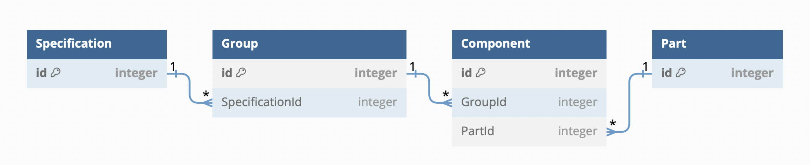

# A factory called "Stuffs are just Stuffs" produces, well, Stuffs

## NPM Commands

"npm start" - start local server

"npm test" - run all tests

## Basic tech stack

Node

Express

TypeScript

Supertest

Jest

Joi

TypeORM

## Architecture

### REST API

### Routes

The routes are designed so that the resource structure is flat. An alternative would be ot have a nested routing scheme, but it will look weird given the heavy tree-like structure of the data.

/specifications

/groups

/components

/parts

### Middlewares

Key functionality chunks are encapsulated into reusble Middlewares. This way we have the flexibility to comgine them in the request-response cycle.

ErrorHandler

JoiValidator

RelationResolver

SpecificationValidator

GroupValidator

ComponentValidator

## Framework

Given the nature of the project we have repetitive CRUD operations on several resources. Ideally we want to reduce retyping the same code again.

### Generic Router

The rouiting class is responsible for just redirecting the requiest to the proper generic controller.

### Generic Controller

The generic controlelr is the bread and butter for implementing CRUD operations on different types of entitites using TypeScript generics.

### Common Validator

The service is set so that we have valdiatoins on both the request body and request params.

### Database

The database is designed around the main entities - Specification, Group, Components and Parts. The relations are defining a treelike structure as:

Specification - Group: one to many

Group - Component: one to many

Component - Part: many to one

### Tests

There are integration tests covering the basic CRUD operations on all resources.
